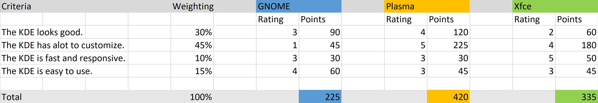

## Decide

### Which operating system

I decided to use Arch as the base for my operating system because Arch Linux is very user-friendly and simple. Arch Linux is very widely used and is one of the most popular Linux distributions.

Linux Mint is less common and Kali Linux is more for advanced users. Kali Linux is more used for hacking and is less suitable for everyday use.

### Which desktop environment

I chose Plasma for the desktop environment because it is very fast and offers the most customizations. It also stands out from the others because of the many customization options and I also like it the best visually.

### Decision matrix

Here you can clearly see that Plasma fits my preferences the most.
 
