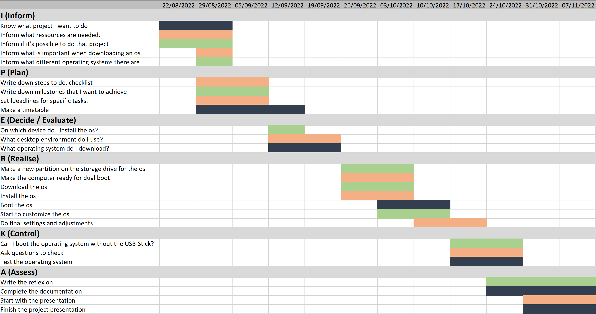

## Planning:

### How did I do the planning?
I first thought about what goes into good planning.
Then I made a task list so I knew exactly what needed to be done. I also created a timetable and set deadlines for the tasks.
I also set milestones on the timetable. 

### Step-by-step task list:

1. inform, about what is important when downloading a custom os
2. make a new partition on the storage drive for the new os
3. make computer ready for dual boot
4. find an operating system with many options to customize it
5. download the os on a USB stick
6. install the os on the laptop
7. boot the os
8. do optional customizations, so that the os runs smoother
9. do optional customizations for the design of the os
10. test the operating system
11. download different applications on the os
12. make final adjustments
13. test the operating system again
14. create the documentation
15. analyze the project
16. make a presentation of the project

### Timetable with deadlines

The scheduling worked very well. I made a task list which made it easier for me to work on the project. Unfortunately, I couldn't always meet the deadlines in the timetable because there were problems with some steps and it took longer.
