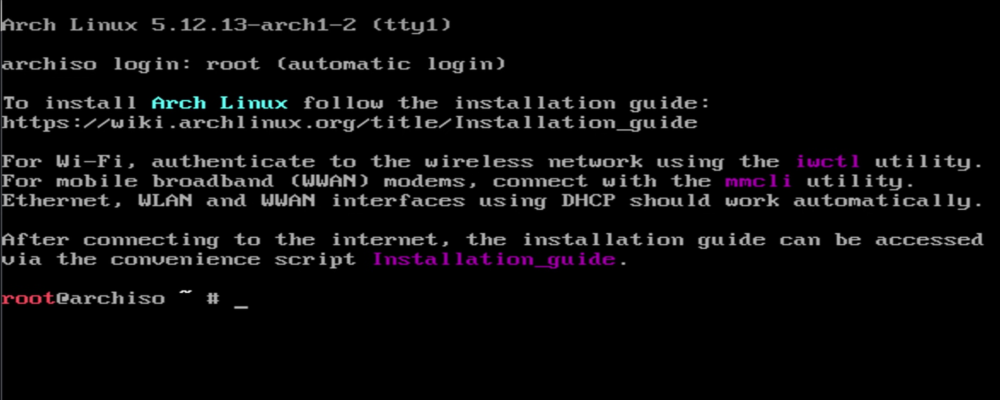
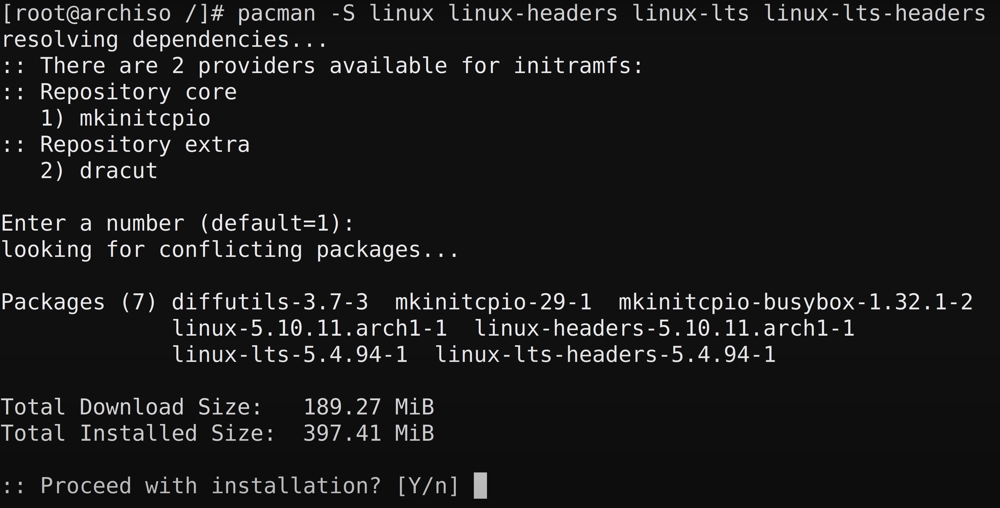
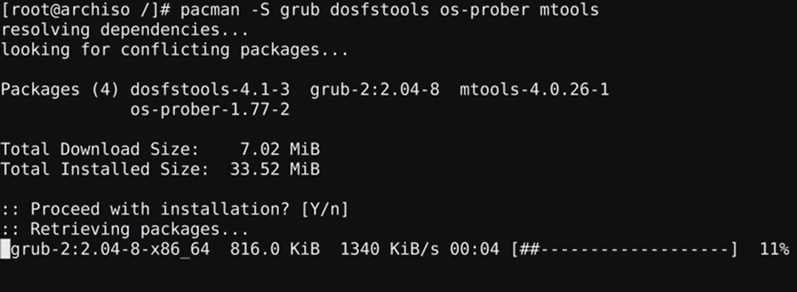
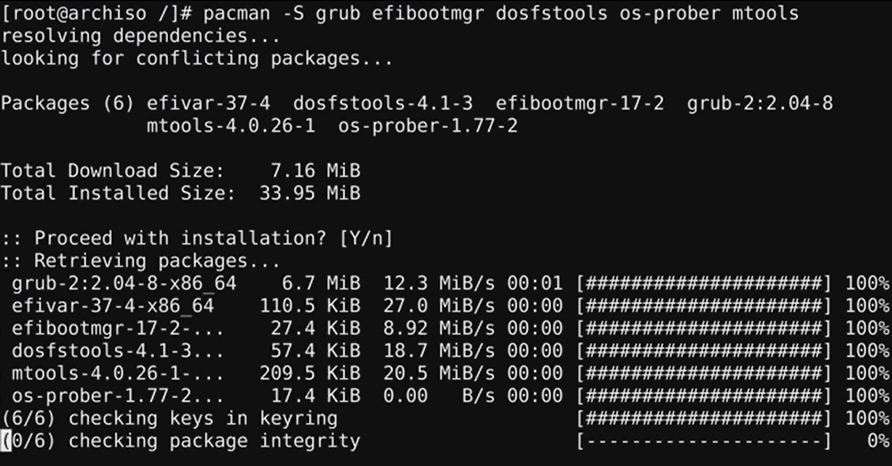
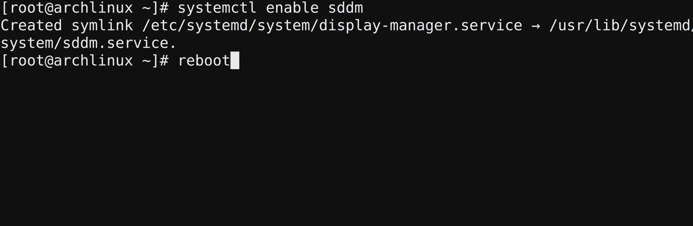
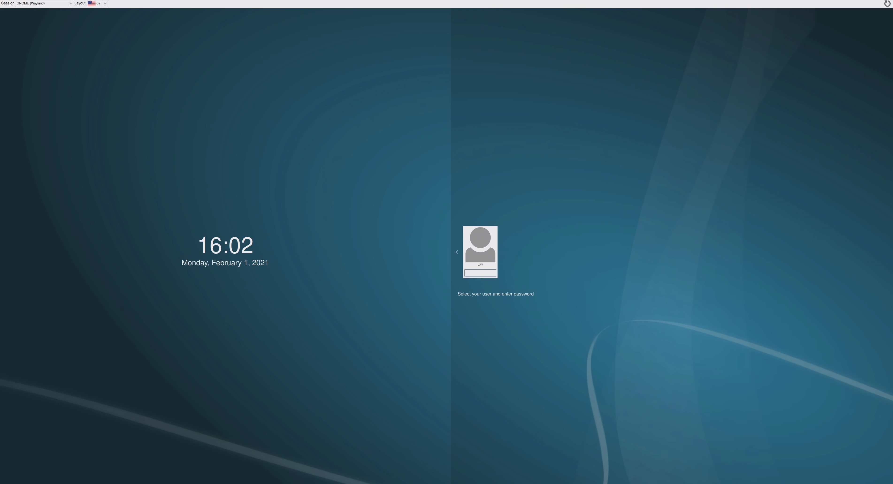
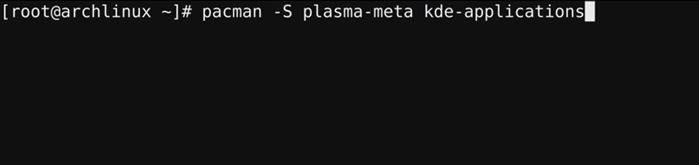

## Realisation
### Download the iso File
I have downloaded the iso file I need for the installation of Linux Arch on a USB stick. I downloaded the iso file from the official site of Linux Arch.

### Setup of the linux Arch Command console
I put the USB stick in my laptop and pressed F12 on startup to get into the bootmenu. In the bootmenu I selected the USB-stick and finally got to the linux Arch console.

### Installing Linux Arch
In the console I had to enter a lot of commands. It was not very difficult because the tutorial on Youtube helped me a lot. First I had to have a stable internet connection and I used the Ethernet cable. 
In the next step, I set up the storage device and created two partitions. 
After that I installed some packages for Linux Arch. For this I used the command: pacman -S (package name).

These packages contain extra functions and make the system work better. 
I also enabled services that should start when Linux Arch starts. For this I used the command: systemctl enable (name of the service)

### Installation Bootloader GRUB
I need a bootloader, so I can boot Linux Arch without the USB stick. For this I use GRUB.
I installed GRUB again with the command Pacma -S.
Afterwards I restarted the operating system and could boot Linux Arch without the USB stick. Now only a nice desktop environment is missing.

### Installing the sddm
I installed the login screen of KDE.

### Installing Plasma KDE
This step didn't quite work. during the download there were some errors where the host wasn't found. Because of this I could not login to the
login screen.

